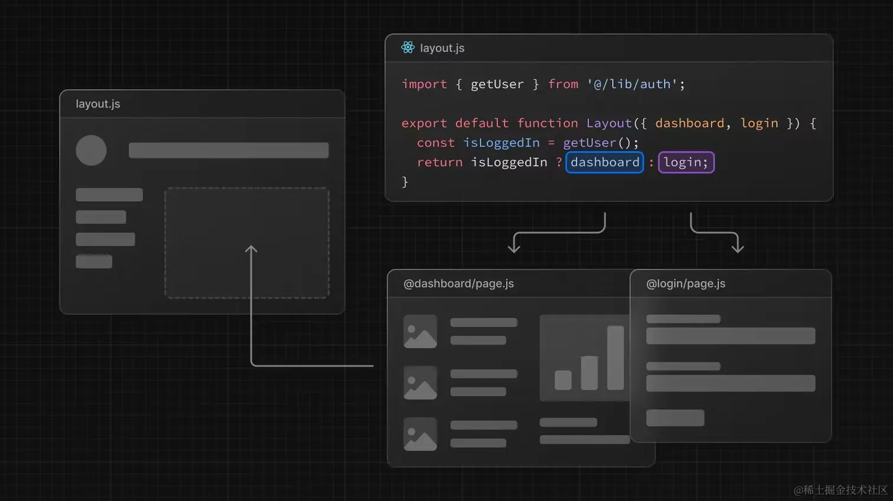

Parallel Routes 是 Next.js 14 引入的一个新特性,允许您在同一布局中同时呈现多个页面。这为创建复杂的用户界面提供了更大的灵活性。让我们逐步了解这个概念:

1. 基本概念

Parallel Routes 允许您独立地加载和渲染同一布局中的多个页面。这些页面可以有自己的加载和错误状态,并且可以独立地进行导航。

2. 语法

Parallel Routes 使用特殊的文件命名约定来实现:

```
app/
├── @team/
│   └── page.js
├── @analytics/
│   └── page.js
└── layout.js
```

在这个例子中,`@team` 和 `@analytics` 是 Parallel Routes。

3. 在布局中使用

在 layout.js 文件中,您可以这样使用 Parallel Routes:

```jsx
export default function Layout({ team, analytics, children }) {
  return (
    <>
      {children}
      {team}
      {analytics}
    </>
  )
}
```

4. 条件渲染

您可以根据条件来决定是否渲染某个 Parallel Route:

```jsx
export default function Layout({ dashboard, login }) {
  return isLoggedIn ? dashboard : login
}
```



5. 模态框和复杂 UI

Parallel Routes 特别适合实现模态框和其他复杂的 UI 模式:

```jsx
app/
├── page.js
├── @modal/
│   └── login/
│       └── page.js
└── layout.js
```

在 layout.js 中:

```jsx
export default function Layout({ children, modal }) {
  return (
    <>
      {children}
      {modal}
    </>
  )
}
```

6. 导航

您可以使用 Next.js 的 Link 组件或 useRouter 钩子来导航到 Parallel Routes:

```jsx
import Link from 'next/link'

// 使用 Link
<Link href="/dashboard/settings">Settings</Link>

// 使用 useRouter
import { useRouter } from 'next/navigation'

const router = useRouter()
router.push('/dashboard/settings')
```

7. 加载和错误处理

每个 Parallel Route 可以有自己的 loading.js 和 error.js 文件,用于处理加载状态和错误:

```
app/
├── @team/
│   ├── loading.js
│   └── error.js
└── @analytics/
    ├── loading.js
    └── error.js
```

8. 注意事项

- Parallel Routes 是可选的。如果某个路由不存在,Next.js 会优雅地处理这种情况。
- 您可以嵌套使用 Parallel Routes。
- Parallel Routes 与服务器组件和客户端组件都兼容。

Parallel Routes 为 Next.js 应用程序提供了强大的布局和路由控制能力,使得构建复杂的、动态的用户界面变得更加简单和灵活。

### default.js

`default.js` 是 Parallel Routes 中的一个特殊文件,它在以下情况下起作用:

1. 兜底渲染

当一个 Parallel Route 的槽位没有匹配的活跃状态时,`default.js` 会被渲染。这就像是一个"后备"或"默认"视图。

2. 语法和位置

`default.js` 文件应该放在 Parallel Route 文件夹的根目录下:

```
app/
├── @team/
│   ├── default.js
│   └── page.js
└── layout.js
```

3. 使用场景

假设您有一个布局,其中包含一个主内容区和一个侧边栏。侧边栏可能会显示不同的内容,但当没有特定内容时,您希望显示一个默认视图:

```jsx
// app/layout.js
export default function Layout({ children, team }) {
  return (
    <div>
      <main>{children}</main>
      <aside>{team}</aside>
    </div>
  )
}
```

当访问 `/` 路径时,如果没有匹配 `@team` 的内容,`default.js` 将被渲染在侧边栏中。

4. 示例

```jsx
// app/@team/default.js
export default function Default() {
  return <p>选择一个团队来查看详情</p>
}
```

5. 与 404 的区别

`default.js` 不同于 `not-found.js`。`not-found.js` 用于处理 404 错误,而 `default.js` 是为了提供一个默认视图。

6. 动态渲染

`default.js` 可以是一个动态组件,根据当前路由或其他条件来渲染不同的内容。

```jsx
// app/@team/default.js
'use client'

import { usePathname } from 'next/navigation'

export default function Default() {
  const pathname = usePathname()
  
  if (pathname === '/projects') {
    return <p>选择一个项目来查看团队成员</p>
  }
  
  return <p>选择一个选项来查看团队信息</p>
}
```

7. 优先级

如果存在 `default.js`,它会优先于显示 `null` 或不渲染任何内容。

总的来说,`default.js` 提供了一种优雅的方式来处理 Parallel Routes 中的默认状态或空状态。它增强了用户体验,确保即使在没有特定内容的情况下,UI 也能保持一致和信息丰富。

这个功能特别有用于构建复杂的仪表板、多面板界面或任何需要条件性内容显示的场景。