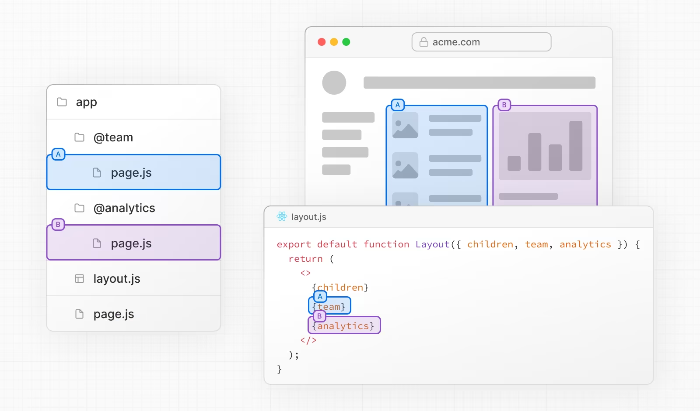
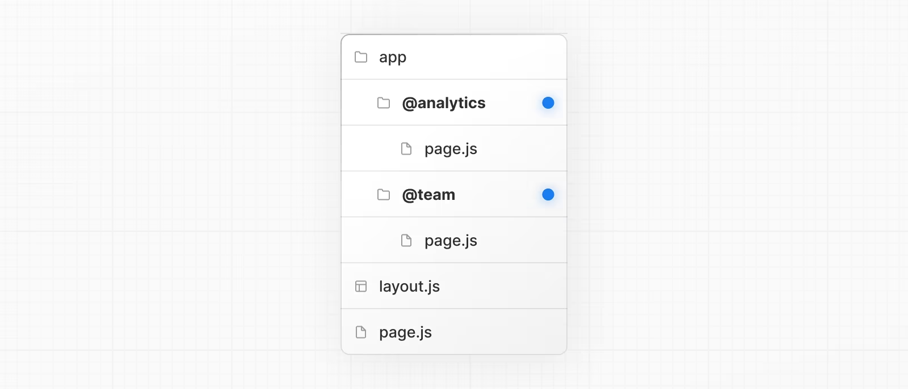

```
app/
  @modal/
    login/
      page.js
  dashboard/
    page.js
```

### 并行路由

平行路由允许您在同一布局中同时或有条件地呈现一个或多个页面。它们对于应用程序中高度动态的部分（例如社交网站上的仪表板和提要）非常有用。

例如，考虑一个仪表板，您可以使用并行路由同时呈现`团队`和`分析`页面：



### 插槽

使用命名插槽创建并行路由。插槽使用 `@folder` 约定定义。例如，以下文件结构定义了两个插槽：`@analytics` 和 `@team`：



插槽作为 props 传递给共享的父布局。对于上述示例，`app/layout.js` 中的组件现在接受 `@analytics` 和 `@team` 插槽 props，并可以并行呈现它们以及 `children` prop：

```tsx
export default function Layout({
  children,
  team,
  analytics,
}: {
  children: React.ReactNode
  analytics: React.ReactNode
  team: React.ReactNode
}) {
  return (
    <>
      {children}
      {team}
      {analytics}
    </>
  )
}
```

但是，插槽不是路由段，不会影响 URL 结构。例如，对于 `/@analytics/views`，URL 将是 `/views`，因为 `@analytics` 是一个插槽。

::: tip
值得知道的是：

`children` prop 是一个隐式的插槽，不需要映射到文件夹。这意味着 `app/page.js` 等同于 `app/@children/page.js`。
:::

### 活动状态和导航

默认情况下，Next.js 会跟踪每个插槽的活动状态（或子页面）。但是，在插槽内呈现的内容将取决于导航类型：

软导航：在客户端导航期间，Next.js 将执行部分渲染，更改插槽内的子页面，同时保持其他插槽的活动子页面，即使它们不匹配当前的 URL。

硬导航：在完整页面加载（浏览器刷新）后，Next.js 无法确定不匹配当前 URL 的插槽的活动状态。相反，它将为不匹配的插槽呈现 default.js 文件，如果不存在 default.js，则呈现 404 页面。

